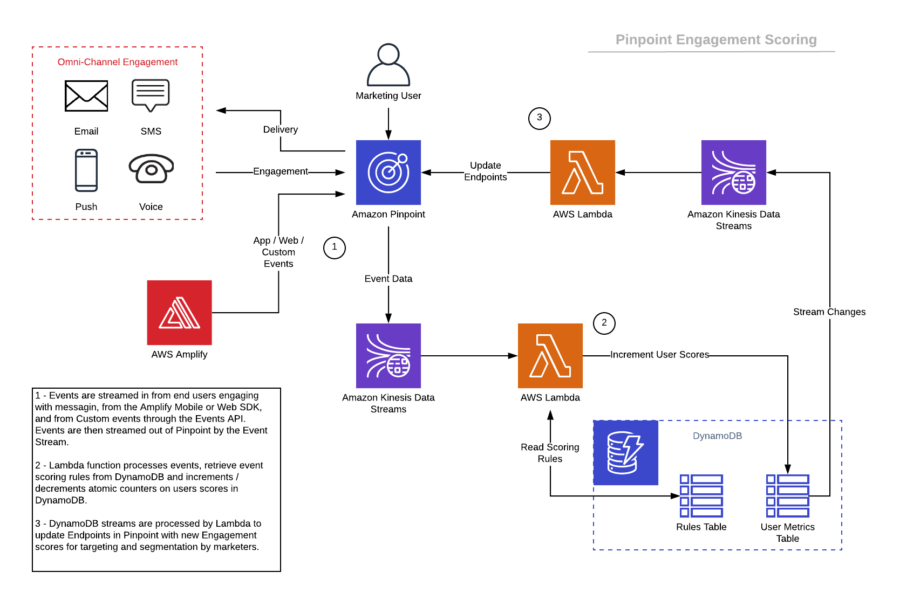
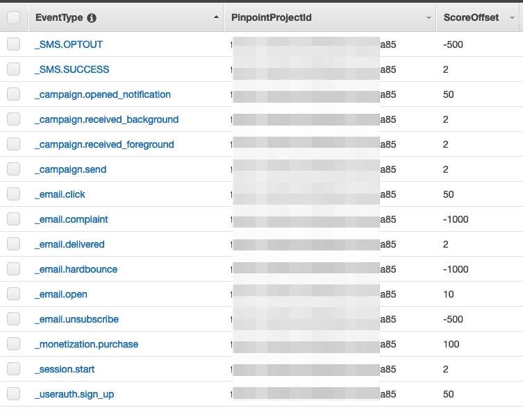

# Amazon Pinpoint Engagement Scoring Solution

Use Amazon Pinpoint's Event Stream data to perform engagement scoring on your customers.  Increment or decrement scores based upon events as they flow through Pinpoint. As customers open or click emails, sms messages, or push messages - automatically keep track of an engagement score.

## Architecture


## Repository content
Main files:
```bash
.
├── README.MD                                           <-- This instructions file
├── cloudformation                                      <-- Folder for the AWS CloudFormation Templates
│   └── template.yaml                                   <-- Template to configure the solution
```

## Solution

This solution deploys the necessary AWS components to build a simple scoring model
* Using the Pinpoint Project ID provided, create a Project Event Stream configuration to stream events to a deployed Kinesis Data Stream
* Amazon DynamoDB Tables
  * Scoring Definition Table, pre-populated by CloudFormation with data.  See Screenshot below
  * User Score Table to keep track of the current user's aggregated score
* DynamoDB Stream to capture changes to the User Score Table records
* AWS Lambda Functions
  * Function to process events from the Kinesis Data Stream that will look up the event in DynamoDB and then increment the current users score.
  * Function to process the DynamoDB streams to update Pinpoint Endpoint data with the newly calculated score
* Halper Lambda Function that is called only during CloudFormation deploy to populate the score definition tables with initial Values.  See Screenshot Below

#### Initial score definition values pre-populated by CloudFormation Screenshot


## Testing

Navigate to the Amazon Pinpoint Console and select the Project used in the CloudFormation template deployment.  Create a campaign targeting users and execute.  As users interact with the messages, events will flow through the event stream, which will be scored and stored into DynamoDB.  Changes to the tables will trigger another stream that will update Pinpoint with the newly created score.  A Segment Export can then be performed which will show the user score!
