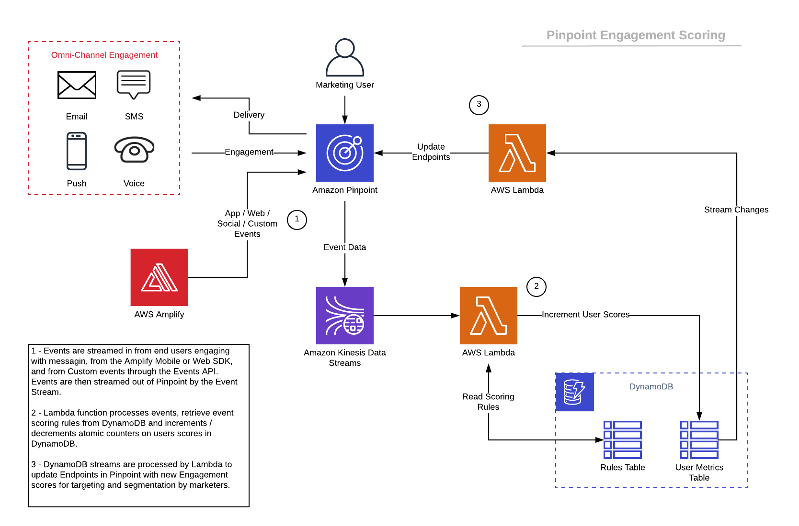

# Amazon Pinpoint Engagement Scoring Solution

Use Amazon Pinpoint's Event Stream data to perform engagement scoring on your customers.  Increment or decrement scores based upon events as they flow through Pinpoint. As customers open or click emails, sms messages, or push messages - automatically keep track of an engagement score.

## Architecture


# Repository content
Main files:
```bash
.
├── README.MD                                           <-- This instructions file
├── cloudformation                                      <-- Folder for the AWS CloudFormation Templates
│   └── template.yaml                                   <-- Template to configure the solution
```
